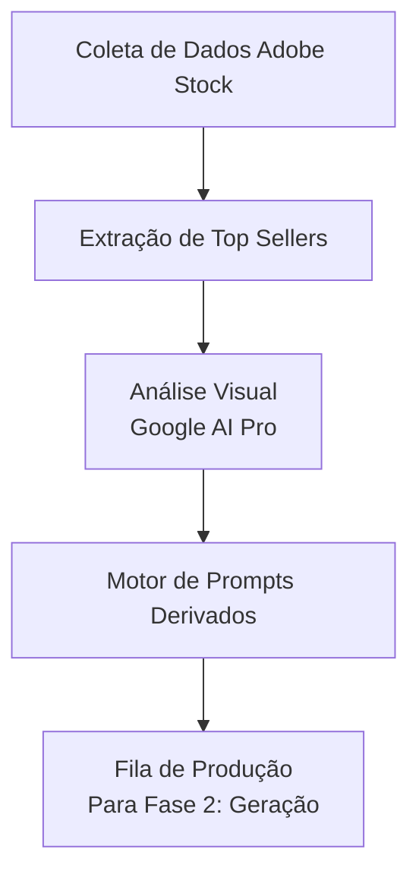

# Phase 1: O "Olheiro" (Trend Analyzer)

## Objetivo
Criar um sistema automatizado para identificar tendências de alta demanda em bancos de imagens (Adobe Stock) e extrair conceitos visuais (estilo, cores, composição) para geração de prompts derivados em massa.

## Fluxo de Trabalho (Workflow)

## Componentes Principais

### 1. Coletor de Tendências (Scraper)
*   **O que faz:** Varre as páginas de "Tendências" e buscas populares ordenadas por "Mais Vendidos".
*   **Dados coletados:** Imagens de preview, títulos, estilo e categoria.
*   **Frequência recomendada:** 1x por semana.
*   **Tecnologia:** Python com Playwright (para lidar com páginas dinâmicas) ou alimentação manual por pasta.

### 2. Analisador Visual (Google AI Pro)
*   **O que faz:** Processa as imagens em alta para realizar "engenharia reversa" do que funciona nelas.
*   **Exemplo de Saída:** Identifica o apelo visual (ex: *fundo abstrato 3D, bokeh, neon azul, espaço para texto*).

### 3. Motor de Prompts Derivados
*   **O que faz:** Baseado na análise visual, a IA do Google expande a ideia.
*   **Estratégia:** Se a imagem de sucesso é um "fundo corporativo azul", o motor gera 50 prompts estruturados e otimizados para o ComfyUI/Runninghub.
*   **Formato de Saída:** JSON ou CSV pronto para automação.

## Perguntas para Decisão
1. **Coleta:** O sistema deve raspar o Adobe Stock via automação (Playwright), ou prefere baixar um apanhado de referências manualmente para a IA analisar de uma pasta?
2. **Saída:** Onde devemos guardar a "Fila" de prompts para a fase de geração? (JSON local, SQLite, etc.)
