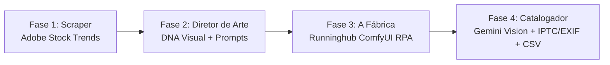

# StockCont 📈🤖

> **Automated end-to-end pipeline for AI stock asset generation, trend analysis, and cataloging.**

StockCont is an autonomous data and production pipeline designed to analyze market trends in microstock platforms (such as Adobe Stock), reverse-engineer visual aesthetics using Multimodal LLMs, and autonomously generate, upscale, and catalog commercial-grade AI assets for microstock sales.

---

## 🏗️ Architecture & Pipeline

The system is organized into a 4-phase production pipeline coordinated by a central CLI orchestrator (`main.py`):



### 1. The "Scout" (Trend Analyzer)
* **Module**: [`src/scraper/adobe_stock.py`](file:///c:/Users/WDAGUtilityAccount/Downloads/Nova%20pasta%20%282%29/src/scraper/adobe_stock.py)
* **Function**: Scrapes top-trending and best-selling assets on Adobe Stock with dynamic niche query support (`--query`, `--order`, `--type`). Downloads reference previews and indexes metadata into `data/raw/trends.json`.

### 2. The "Art Director" (Prompt Engineering)
* **Module**: [`src/analyzer/director.py`](file:///c:/Users/WDAGUtilityAccount/Downloads/Nova%20pasta%20%282%29/src/analyzer/director.py)
* **Function**: Leverages Gemini Multimodal Vision to deconstruct the "visual DNA" (style, lighting, composition, color palette) of trending references, generating commercial derivative prompts stored in `data/processed/prompts.json`.

### 3. The "Factory" (Mass Generation)
* **Module**: [`src/factory/runninghub_bot.py`](file:///c:/Users/WDAGUtilityAccount/Downloads/Nova%20pasta%20%282%29/src/factory/runninghub_bot.py)
* **Function**: RPA automation with Playwright that launches your Runninghub/ComfyUI workflow in a persistent Chrome session and injects prompt batches instantaneously.

### 4. The "Cataloger" (Metadata, IPTC & SEO)
* **Module**: [`src/cataloger/adobe_csv_maker.py`](file:///c:/Users/WDAGUtilityAccount/Downloads/Nova%20pasta%20%282%29/src/cataloger/adobe_csv_maker.py)
* **Function**: Uses sub-3s Gemini Vision analysis on images in `data/final/images/`. Generates a commercial title, 50 ranked keywords, and the category ID. 
  * **IPTC/EXIF Injection**: Embeds Object Name, Caption, and Keywords directly into the image binary, enabling **100% automated form filling** upon uploading to Adobe Stock.
  * **CSV Export**: Appends records into `data/processed/adobe_stock_upload.csv` as a ready-to-use upload backup.

---

## 🚀 Technology Stack

* **Language**: Python 3.11+
* **Web Automation**: Playwright (Sync API with persistent Chrome profile)
* **AI & Vision**: Gemini Multimodal Vision (`gemini-3.5-flash-lite` / `gemini-3.8-flash`) via high-speed REST
* **Metadata Engineering**: `iptcinfo3`, `piexif`, `Pillow`
* **Networking & Data**: `httpx`, `json`, `csv`
* **Testing**: `pytest`, `pytest-playwright`

---

## ⚙️ Installation & Setup

1. **Clone the repository**:
   ```bash
   git clone https://github.com/ciamarrojonatan-droid/stockcont.git
   cd stockcont
   ```

2. **Set up the Virtual Environment**:
   ```bash
   python -m venv venv
   
   # Windows PowerShell
   .\venv\Scripts\Activate.ps1
   
   # Linux / macOS
   source venv/bin/activate
   ```

3. **Install Dependencies**:
   ```bash
   pip install -r requirements.txt
   playwright install chromium
   ```

4. **Environment Variables**:
   Create a `.env` file in the project root:
   ```env
   GEMINI_API_KEY="your_google_gemini_api_key_here"
   ```

---

## 💻 Unified CLI Usage (`main.py`)

StockCont features a master CLI orchestrator:

### 📊 Check Pipeline Dashboard Status
```bash
python main.py --status
```

### 1️⃣ Run Phase 1 (Niche Trend Scout)
```bash
# Scrape best-selling photos in a specific niche:
python main.py --phase 1 --query "business technology team" --order nb_downloads --max-items 10

# Or general trending assets:
python main.py --phase 1
```

### 2️⃣ Run Phase 2 (Generate Prompts with Gemini Vision)
```bash
python main.py --phase 2
```

### 3️⃣ Run Phase 3 (Inject Prompts into Runninghub Bot)
```bash
python main.py --phase 3
```

### 4️⃣ Run Phase 4 (Catalog Images, Embed IPTC/EXIF & Generate CSV)
```bash
python main.py --phase 4
```

### 🔄 Run Entire End-to-End Pipeline
```bash
python main.py --all --query "modern architecture interior" --max-items 15
```

---

## 📄 License
MIT License
